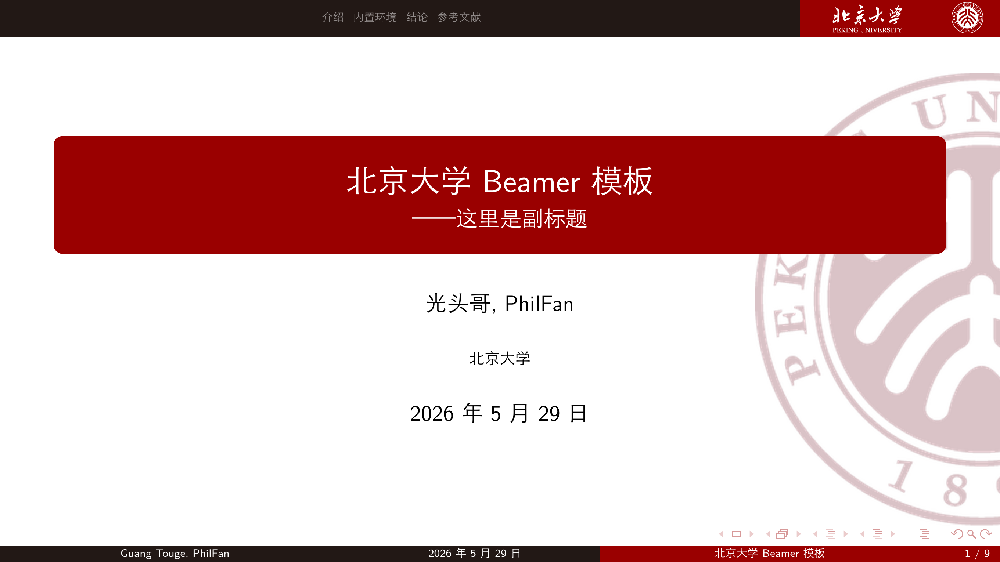
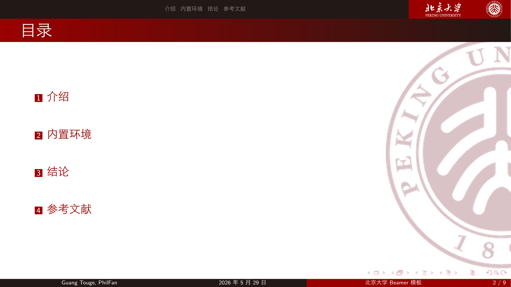
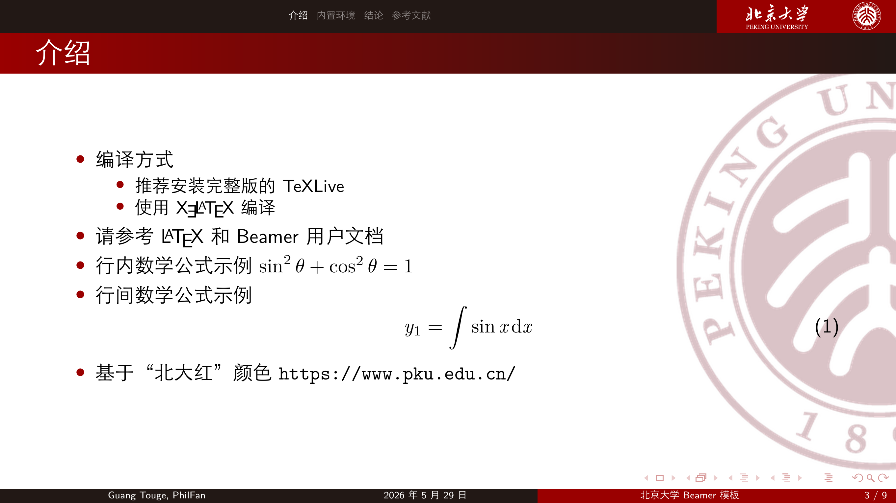
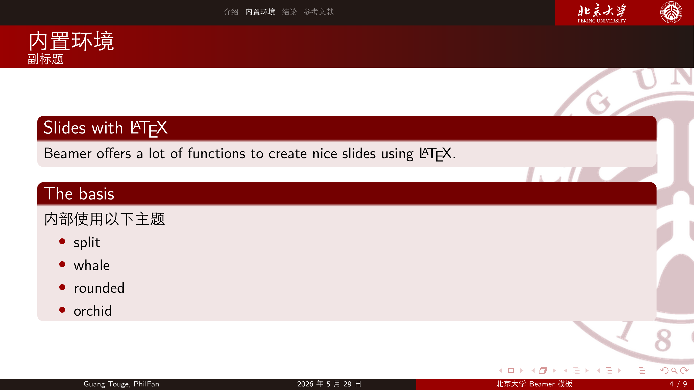
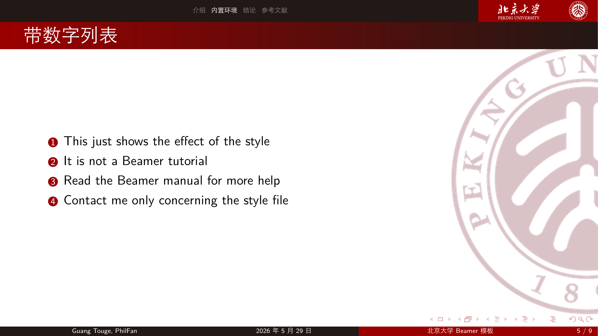
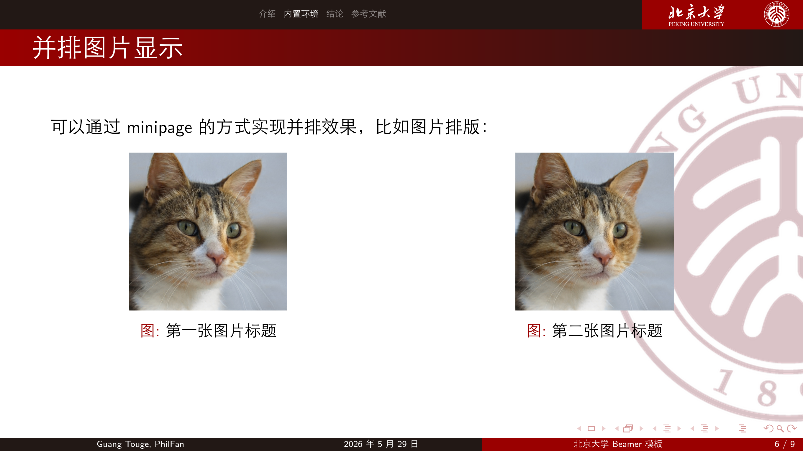
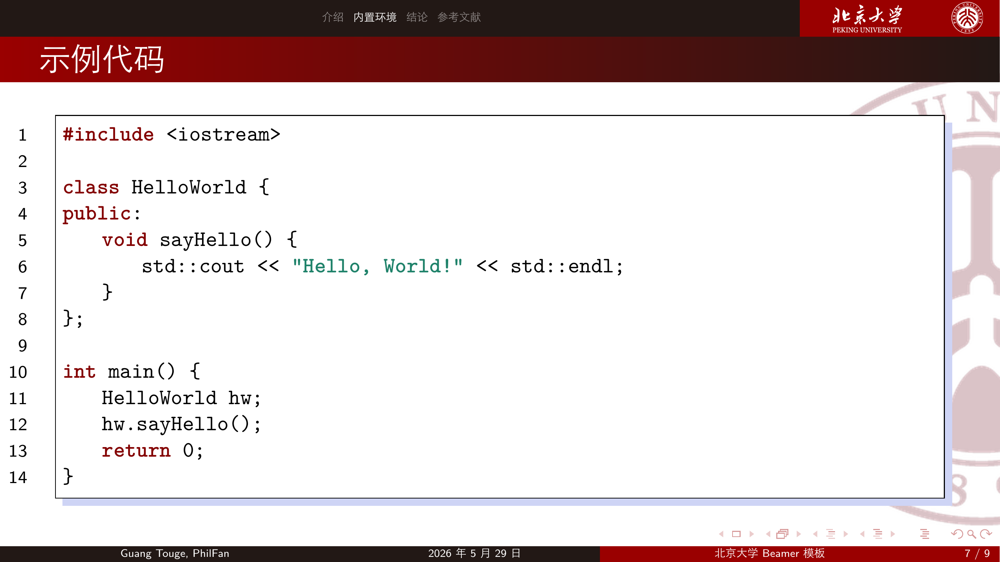
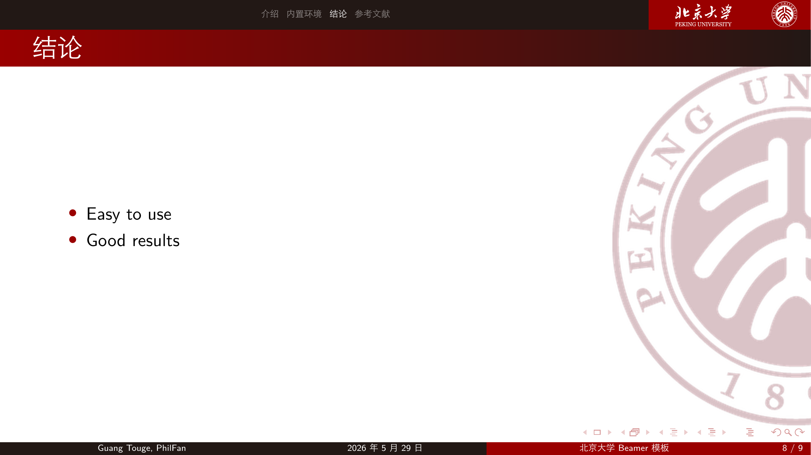
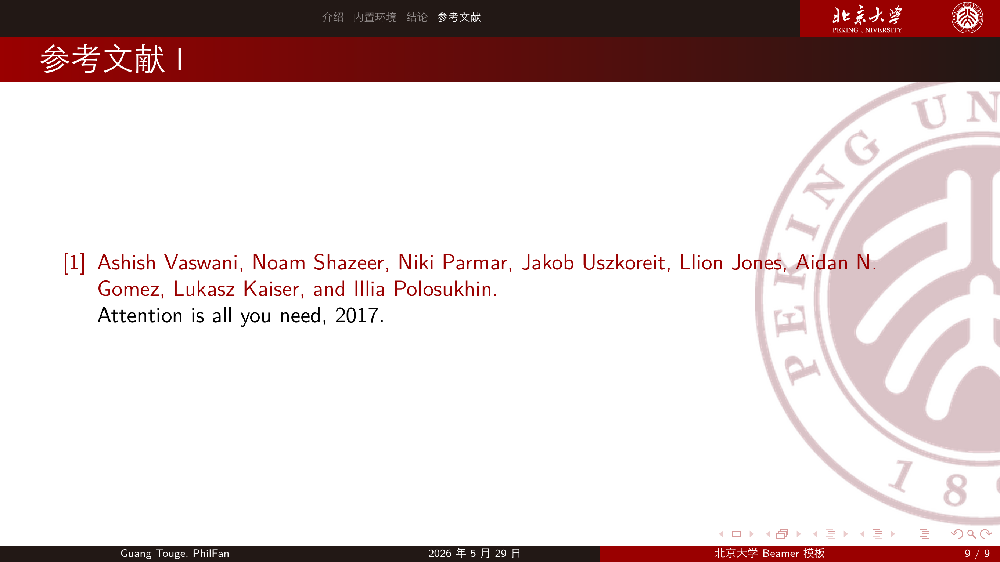

# 北京大学 LaTeX 幻灯片模板

这是一个北京大学风格的 Beamer 幻灯片模板，使用北大红配色、校徽、校名与浅色校徽水印背景。

## 快速开始

请安装完整的 TeX Live 或 MacTeX，并确保本地可使用 `latexmk`。

```shell
latexmk
```

默认入口文件是 `main.tex`，构建配置位于 `.latexmkrc`，输出文件为 `out/main.pdf`。`latexmk` 会自动处理所需的重复编译和参考文献生成，无需手动执行多趟编译命令。

清理构建产物：

```shell
latexmk -C
```

## 文件结构

- `main.tex`：示例幻灯片入口。
- `.latexmkrc`：`latexmk` 构建配置，默认使用 XeLaTeX。
- `pkubeamer.sty`：Beamer 主题样式文件，使用北京大学配色和视觉资源。
- `figures/`：模板直接引用的背景、校徽、校名和示例图片。
- `references.bib`：参考文献示例。

## 预览

示例截图：











## 字体说明

模板使用 `ctex` 默认中文字体配置。如需指定其他字体，可以在样式文件或入口文件中自行调整 `fontspec` / `xeCJK` 相关设置。

## 致谢

本模板由[浙江大学Latex幻灯片模板](https://github.com/qychen2001/ZJU-Beamer-Template)改造而来，感谢原作者公开维护的模板结构与工程基础。原项目也参考了 [华中师范大学beamer模版](https://github.com/K-JW/CCNU_BeamerTemplate)，在此一并致谢。
